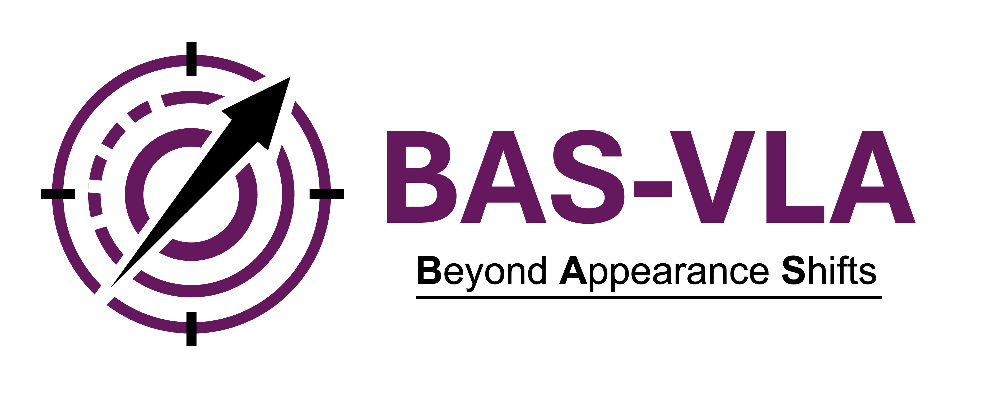

<div align="center">
  <picture>
    <source media="(prefers-color-scheme: dark)" srcset="docs/logo/logo_for_dark_background.png">
    
  </picture>
  <h1>Beyond Appearance Shifts: Task-Semantic Action Calibration for VLA Models</h1>
</div>

<a href="https://example.com"></a>
<a href="https://example.com"></a>
<a href="https://example.com"></a>
<a href="https://example.com"></a>
<a href="https://example.com"></a>
<a href="https://example.com"></a>
<a href="https://example.com"></a>

This repository accompanies the paper:

**Beyond Appearance Shifts: Task-Semantic Action Calibration for VLA Models**

It hosts the **BAS-VLA** code and tooling: method components under `bas_vla/`, benchmark and task configuration under `configs/`, command-line utilities under `scripts/`, runnable wrappers under `launchers/`, and copy-ready command examples under `examples/`. The public package now reflects the paper-facing structure of BAS-VLA: a breaking-centered calibration core together with an evidence-gated preserving auxiliary built from probe, gate, fusion, and deployment modules. Current public entrypoints cover **OpenPI + LIBERO** for semantic-break and appearance-shift settings, plus a baseline **OpenVLA-OFT + LIBERO** semantic-break runner.

## Contents

- **Method code** (`bas_vla/`): breaking adapter and training helpers, evidence-gated preserving auxiliary modules, runtime helpers for OpenPI / OpenVLA-OFT / LIBERO, analysis and bootstrap helpers, media montages, record checks, and evaluation integration helpers
- **Configurations** (`configs/`): semantic-break and formal rollout settings, including LIBERO-oriented setups and sample formal task matrices for OpenPI + LIBERO-Object
- **Scripts** (`scripts/`): training, OpenPI + LIBERO evaluation and launchers, appearance-pair launchers, summaries, and montage export
- **Launchers** (`launchers/`): top-level wrappers for public script entrypoints
- **Examples** (`examples/`): copy-ready commands for common local runs
- **Reports** (`reports/`): scope, protocol, and integration notes for this codebase
- **Dependencies** (`requirements.txt`): base utilities and environment requirements for OpenPI / OpenVLA-OFT integrations
- **License** (`LICENSE`): MIT license for this repository

## Repository Layout

- `bas_vla/`
  - `breaking/`: residual adapter and training utilities
  - `preserving/`: preserving probe, gate, weak-fusion, deployment, and legacy diagnostic helpers
  - `runtime/`: shared runtime helpers for OpenPI, OpenVLA-OFT, and LIBERO
  - `analysis/`: bootstrap and process-metric helpers
  - `media/`: montage builders for frames and rollout videos
  - `records/`: cached-record loading and summary checks
  - `integrations/`: integration helpers for public evaluation entrypoints
- `scripts/`
  - public CLI entrypoints for training, evaluation, summaries, and media export
- `launchers/`
  - top-level wrappers for the most common public runs
- `examples/`
  - minimal commands that can be copied into a local shell
- `configs/`
  - stable semantic-break and formal rollout configurations
- `reports/`
  - scope, protocol, and integration notes
- `docs/`
  - website-oriented assets

## Documentation

1. `reports/public_scope.md`
2. `reports/protocol_scope.md`
3. `reports/integration_guidance.md`

Documentation in this repository is in English.

## Scripts

- `scripts/train_breaking_adapter.py`
- `scripts/eval_openpi_libero.py`
- `scripts/eval_openpi_appearance_libero.py`
- `scripts/eval_openvla_oft_libero.py`
- `scripts/launch_openpi_main_campaign.sh`
- `scripts/launch_openpi_appearance_formal.sh`
- `scripts/launch_formal_task_triples.sh`
- `scripts/launch_formal_task_matrix.sh`
- `scripts/run_openpi_appearance_pair.sh`
- `scripts/run_openpi_appearance_pair_formal.sh`
- `scripts/run_openpi_appearance_visual_episode.sh`
- `scripts/check_runtime_env.py`
- `scripts/check_semantic_break_pairs.py`
- `scripts/summarize_cached_records.py`
- `scripts/bootstrap_eval.py`
- `scripts/export_process_metrics.py`
- `scripts/make_pair_montage.py`
- `scripts/make_video_montage.py`

## Installation

Set up a local environment and install the Python dependencies:

```bash
python -m venv .venv
source .venv/bin/activate
pip install -r requirements.txt
```

Then create a local environment file from `.env.example` and fill in the external runtime paths for the official model and benchmark repositories.

```bash
cp .env.example .env
```

Optional grounded preserving backends can be enabled by setting:

- `BAS_GROUNDING_DINO_MODEL_ID`
- `BAS_SAM2_MODEL_ID`
- `BAS_GROUNDED_DEVICE`

When these variables are not set, the preserving auxiliary falls back to the style-oriented public probe.

## Quickstart

1. Configure the environment variables in `.env`.
2. Verify the local runtime.
3. Run one example command from `examples/`.

### Check the runtime

```bash
python scripts/check_runtime_env.py
```

### Run one OpenPI + LIBERO semantic-break example

```bash
bash examples/run_openpi_semantic_break.sh
```

### Run one OpenPI + LIBERO appearance-shift example

```bash
bash examples/run_openpi_appearance_shift.sh
```

Optional preserving-side execution can be enabled in the public runners with:

```bash
--preserving-mode pres
```

### Run one OpenVLA-OFT + LIBERO semantic-break baseline

```bash
bash examples/run_openvla_oft_semantic_break.sh
```

The OpenVLA-OFT semantic-break runner also exposes:

```bash
--preserving-mode default|pres|full
```
